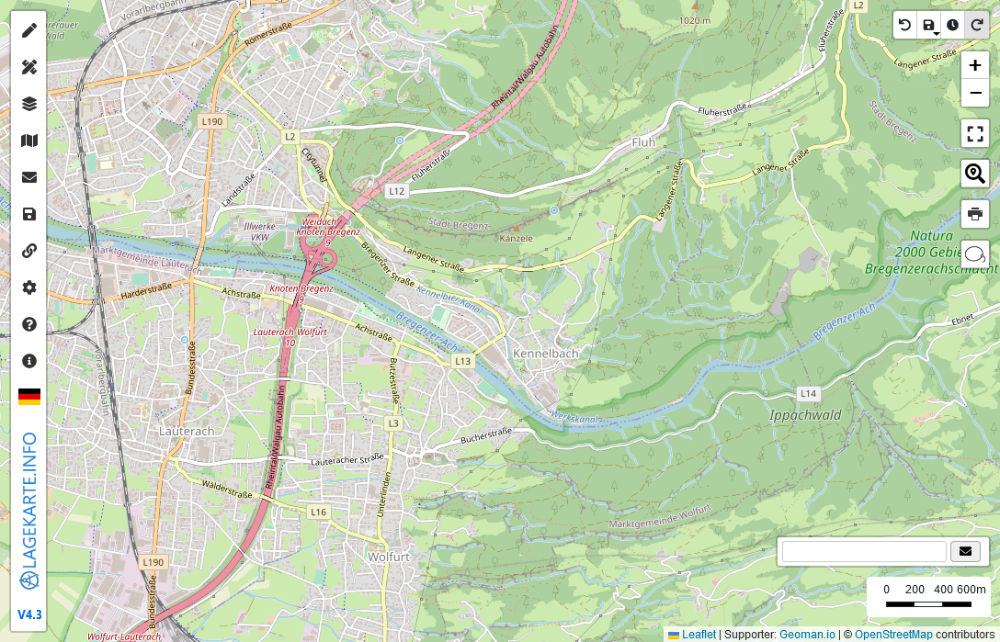
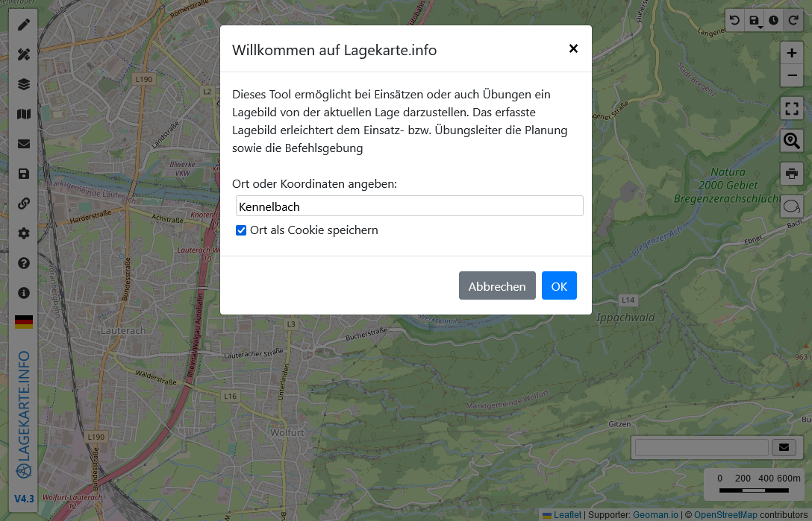
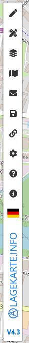
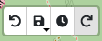
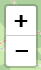
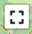
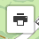
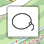
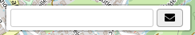

# Dokumentation für Lagekarte.info

[Lagekarte.info](https://www.lagekarte.info) wurde als kostenloses Tool kozipiert, um während einem **Einsatz** eine Lageführung erstellen zu können. Es wird auch gerne als Übungsvorbereitung verwendet.

## Einstieg

Beim öffnen der Lagekarte ist es möglich einen Ort, Straße oder Koordinaten anzugeben. Diese Information kann auch für die Zukunft als Standardwert gespeichert werden.

## Controls auf der Karte

### Sidebar
Auf der linken Seite befindet sich die **Sidebar**. Darüber können Objekete gezeichnet, die Hintergrundkarte geändert, Projekte gespeichert / geladen, Datenquellen hinzugefügt werden und noch vieles mehr. [Mehr Informationen](sidebar/README.md)

### Verlauf

Es gibt die Möglichkeit die letzten Aktionen Rückgängig zu machen bzw. wiederherzustellen.

Zusätzlich gibt es auch noch die Möglichkeit das Projekt zu speichern 🔑 oder einen Zeitpunkt zu speicher. [Mehr Informationen](sidebar/save.md#speichern-und-teilen)

Tastenbefehl: Rückgängig: `<`, Wiederherstellen: `>` (Shift + <)

### Zoomen
Über die Zoom Kontrollbuttons kann hinein und heraus gezoomt werden.

Tastenbefehl: `+` & `-`

### Alles anzeigen
Alle Objekte auf der Karte auf der höchst möglichen Zoomstufe anzeigen. 

Tastenbefehl: `o`

### Suche
Ort, Straße oder Koordinaten suchen. Es kann eine Detailsuche / Korrdinaten Konverter über das Icon geöffnet werden. [Mehr Informationen](sidebar/funktionen.md#suche-koordinaten-konverter)

### Drucken
Karte drucken / als Bild speichern. Mit `Shift + Klick` auf den Control kann der "Schnellmodus" aktiviert werden, welcher die Einstellungen vom letzten Druck verwendet. [Mehr Informationen](drucken.md)

### Lasso
Objekte auswählen und dann gemeinsam bearbeiten.

Tastenbefehl: `ö`

### Meldung
Eine aktuelle Meldung im Protokoll hinzuzufügen. [Mehr Informationen](sidebar/meldungen.md#meldungen)

