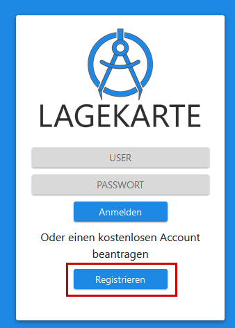

# Registrieren

Über einen **kostenlosen** Account stehen weitere Features zur Verfügung. Diese sind mit einem 🔑 gekennzeichnet.

Um sich zu registrieren, muss über [www.lagekarte.info/login.html](https://www.lagekarte.info/login.html) ein Account beantragt werden. Es fallen keine Kosten an. Alle Kosten werden von dem [Team122.at](www.team122.at) getragen.

# Login

In dem [*Einstellungen*-Tab](sidebar/settings.md) kann man sich anmelden.

# Features mit einem Account

- [Projekte speichern](sidebar/save.md#🔑-projekte)
- [Projekte teilen](sidebar/save.md#projekt-teilen)
- [APIs / Externe Dienste](sidebar/settings.md#🔑-apis--externe-dienste)
- [Karten / Overlays speichern](sidebar/maps.md#hinzufügen)
- [Vorlagen speichern](sidebar/draw.md#vorlagen)