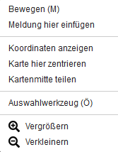
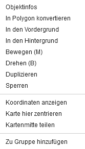
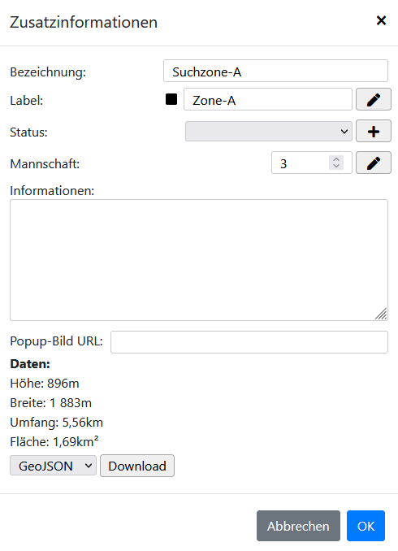
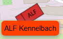
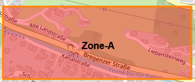
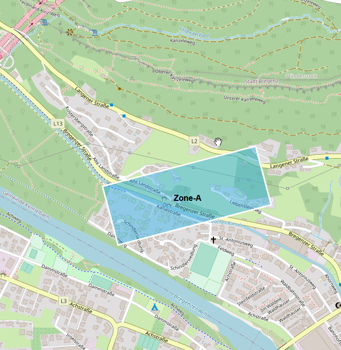

# Contextmenu

Das Contextmenu kann mit einen `Rechts Klick` auf der Karte oder auf einem Objekt geöffnet werden.

## Karte

| Funktion                 | Beschreibung                                                                                                                                                                          |
|--------------------------|---------------------------------------------------------------------------------------------------------------------------------------------------------------------------------------|
| Bewegen                  | Geht in den Bewegenmodus. Objekte können dann verschoben werden. [mehr](../sidebar/draw.md#bearbeiten)                                                                                |
| Meldung hier einfügen    | Es wird an dieser Stelle eine Meldung mit einem Marker hinzugefügt. [mehr](../sidebar/meldungen.md#3-contextmenü-meldung-hier-einfügen)                                               |
| Koordinaten anzeigen     | Zeigt die Koordinaten und falls vorhanden die Höhenmeter der Position an.                                                                                                             |
| Karte hier zentrieren    | Rückt die Position in den Mittelpunkt.                                                                                                                                                |
| Kartenmitte teilen       | Erstellt einen Link mit den Koordinaten der Mitte von der Karte. [https://www.lagekarte.info/de/?center=47.480156,9.763842](https://www.lagekarte.info/de/?center=47.480156,9.763842) |
| Auswahlwerkzeug          | Aktiviert das Lasso-Tool zum auswählen merherer Objekte. [mehr](../README.md#lasso)                                                                                                   |
| Vergrößern / Verkleinern | Hinein und heraus zoomen.                                                                                                                                                             |

## Objekt

| Funktion                | Beschreibung                                                                                                                                                                          |
|-------------------------|---------------------------------------------------------------------------------------------------------------------------------------------------------------------------------------|
| Objektinfos             | Öffnet einen Dialog mit Informationen zu dem Objekt. [mehr](#objektinfos)                                                                                                             |
| In Polygon konvertieren | Nur für `Rechteck` verfügbar: Konvertiert ein Rechteck zu einem Polygon. Die Punkte können dann anderst verschoben werden.                                                            |
| In den Vordergrund      | **Nicht** für `Symbole` verfügbar: Verschiebt das Objekt bei einer Überlappung nach ganz oben.                                                                                        |
| In den Hintergrund      | **Nicht** für `Symbole` verfügbar: Verschiebt das Objekt bei einer Überlappung nach ganz unten.                                                                                       |
| Bewegen                 | Geht in den Bewegenmodus. Objekte können dann verschoben werden. [mehr](../sidebar/draw.md#bearbeiten)                                                                                |
| Drehen                  | Ermöglicht es das Objekt zu drehen.                                                                                                                                                   |
| Duplizieren             | Kopiert das Objekt an der gleichen Stelle.                                                                                                                                            |
| Sperren / Entsperren    | Verhindert das Bearbeiten des Objekts.                                                                                                                                                |
| Koordinaten anzeigen    | Zeigt die Koordinaten und falls vorhanden die Höhenmeter der Position an.                                                                                                             |
| Karte hier zentrieren   | Rückt die Position in den Mittelpunkt.                                                                                                                                                |
| Kartenmitte teilen      | Erstellt einen Link mit den Koordinaten der Mitte von der Karte. [https://www.lagekarte.info/de/?center=47.480156,9.763842](https://www.lagekarte.info/de/?center=47.480156,9.763842) |
| Zu Gruppe hinzufügen    | Das Objekt kann zu einer Gruppe hinzugefügt werden. [mehr](../sidebar/layers.md#gruppen)                                                                                              |

### Objektinfos

| Funktion      | Beschreibung                                                                                                                                                                                |
|---------------|---------------------------------------------------------------------------------------------------------------------------------------------------------------------------------------------|
| Bezeichnung   | Name des Objekts.                                                                                                                                                                           |
| Label         | Dem Objekt wird ein Label auf der Karte hinzugefügt. Es kann die Schriftgrößer und Farbe bearbeitet werden.                                                                                 |
| Status        | **Nicht** für `Symbole` verfügbar: Es können verschiedene Status angelegt werden, welche zur Farblichen markierung verwendet werden können.                                                 |
| Mannschaft    | Es kann eine Zahl oder Namentlich hinterlegt werden, welche Mannschaft dafür eingteilt ist. Kann über die [Mannschaftsliste](../sidebar/funktionen.md#mannschaftsliste) ausgewertet werden. |
| Informationen | Ein Feld zum ablegen von unterschiedlichen informationen.                                                                                                                                   |
| Daten         | Zeigt verschiedene Daten an. Position, Breite, Länge, Umfang, Fläche, ...                                                                                                                   |
| Download      | Das Objekt kann als `GeoJSON`, `KML` oder `GPX` heruntergeladen werden.                                                                                                                     |

**Label:**

**Status**:

