# Zeichnen

In diesem Tab der Sidebar befinden sich alle Tools um auf der Karte Objekte einzufügen oder zu zeichnen.

## Zeichen Tools

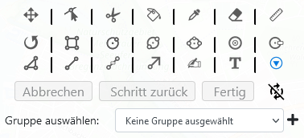

#### Bearbeiten

| Symbol                                   | Name       | Tastenkürzel |
|------------------------------------------|------------|--------------|
| 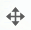    | Bewegen    | M            |
| 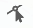    | Bearbeiten | E            |
| 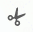     | Schneiden  | C            |
| 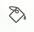  | Einfärben  | F            |
| 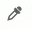 | Pipette    | P            |
|   | Löschen    | ENTF         |
| 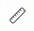      | Messen     | H            |
| 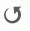  | Drehen     | B            |

#### Zeichnen

| Symbol                                           | Name           | Tastenkürzel |
|--------------------------------------------------|----------------|--------------|
| 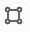       | Rechteck       | R            |
| 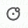          | Kreis          | K            |
| 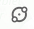       | Kreis 2-Punkt  |              |
| 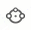       | Kreis 3-Punkt  |              |
| 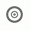       | Gefahrgutzonen | G            |
| 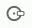 | Distanz Kreis  | I            |
|          | Polygon        | N            |
| 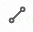            | Linie          | L            |
| 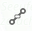   | Distanz Linie  | J            |
| 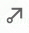           | Pfeil          | A            |
| 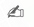        | Freihand       | D            |
|             | Text           | T            |

Bei **Linie**, **Distanz Linie**, **Polygon**, **Rechteck**, **Pfeil** kann man während dem zeichnen **Shift** gedrückt halten, dann wird im **Ortho-Modus** gezeichnet.

#### Optionen

| Symbol                                                | Name             | Tastenkürzel | Beschreibung                                                                                      |
|-------------------------------------------------------|------------------|--------------|---------------------------------------------------------------------------------------------------|
| 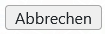             | Abbrechen        | ESC          | Bricht das aktuelle Zeichnen ab oder beendet den Bearbeitungsmodus (ohne zurücksetzen).           |
| 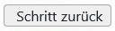 | Schritt zurück   | Z            | Entfernt den zuletzt hinzugefügten Punkt einer Linie.                                             |
| 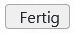             | Fertig           | ENTER        | Speichert das gezeichnete Objekt.                                                                 |
| 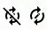  | Weiterzeichnen   | W            | Wenn aktiv kann weitergezeichnet werden, ansonsten wird der Zeichenmodus automatisch deaktiviert. |
| 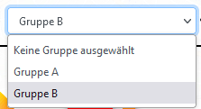       | Gruppe auswählen | Y            | Die neu gezeichneten Objekte können automatisch einer Gruppe hinzugefügt werden.                  |
| 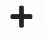                           | Gruppe erstellen |              | Neue Gruppe erstellen, bei welcher Objekte hinzugefügt werden können.                             |

## Farbauswahl

In der Farbauswahl kann die Füllfarbe und die Linienfarbe definiert werden, sowie weitere Optionen ausgewählt werden.

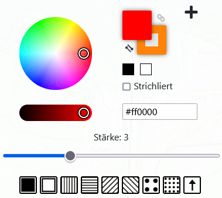

##### Vorschau

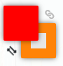

 - Mit klick auf die (hintere) Vorschau, kann zwischen Linienfarbe und Füllfarbe gewechselt werden.
 - Über das *Verlinkungs*-Symbol wird die Füll- und Liniefarbe gleich gesetzt.
 - Über das *Wechsel*-Symbol kann die Farbe zwischen Füll- und Liniefarbe gewechselt werden.

##### Farbe speichern

 - Über das *Plus*-Symbol kann die aktuelle Farbe + Einstellungen als [Farbfeld](#funktionen-farbfelder) gespeichert werden. Nach dem Speichern kann der Name des Farbfelds im Reiter [Funktionen / Farbfelder](#funktionen-farbfelder) angepasst werden.

##### Optionen
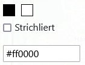

 - Mit klick auf das *Schwarze-* / *Weiße-* Farbfeld, wird die aktuelle Farbe überschrieben.
 - Mit der Checkbox *Strichliert* kann die Linie des Objekts gestrichelt werden.
 - Über das *Farbcodefeld* wird die aktuelle Farbe als Hexidezimal-Code angezeigt und kann auch überschrieben werden.
 - Über den Slider kann die Stärke / Dicke der Linie definiert werden.

##### Muster
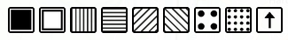
 - Es können verschiedene Muster für die Füllung ausgewählt werden.

##### Funktionen / Farbfelder

In diesem Reiter können die vordefinierten oder eigene Farbfelder als aktuelle Farbe gesetzt werden. 

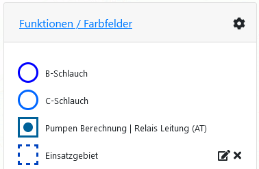

Farbfelder können umbenannt oder gelöscht werden.

Es gibt auch vordefinierte Funktion:

| Funktion                            | Beschreibung                                                                                   |
|-------------------------------------|------------------------------------------------------------------------------------------------|
| B-Schlauch                          | Erstellt eine Linie, welche alle 20 Meter ein Label bekommt. 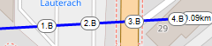 |
| C-SChlauch                          | Erstellt eine Linie, welche alle 15 Meter ein Label bekommt. 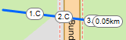 |
| Pumpen-Berechnung \| Relais Leitung | Berechnet die Pumpenstandorte einer Relaisleitung. (Nur in AT möglich) [mehr - TODO](#)        |

## Symbole

Es gibt verschiedene Symbol-Sets. Einige sind genormt andere sind selbst erstellt.

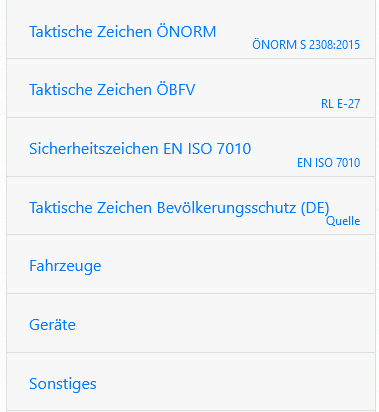

In den [Einstellungen - TODO](#) oder über das *Zahnrad*-Symbol kann eingestellt werden, welche Symbol-Sets angezeigt werden sollen.

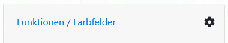

## Vorlagen

Es können Vorlagen erstellt werden, damit Objekte mit nur einem Klick an der richtigen Stelle geladen werden können.

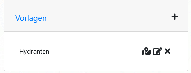

| Symbol                               | Name       | Beschreibung                                                                     |
|--------------------------------------|------------|----------------------------------------------------------------------------------|
|           | Hinzufügen | Es wird die aktuelle Karte mit allen Objekten als Vorlage abgespeichert.         |
|     | Platzieren | Die Objekte werden auf der Karte hinzugefügt.                                    |
|    | Bearbeiten | Es kann der Name und die 🔑 Sichtbarkeit (Benutzer / Organisation) geändert werden. |
|  | Löschen    | Die Vorlage wird gelöscht.                                                       |

### 🔑 Vorlage speichern / Berechtigung

Wenn man angemeldet ist, wird die Vorlage auf dem Benutzerkonto gespeichert. Es kann zusätzlich eingestellt werden, ob alle User aus der gleichen Organisation die Vorlage auch angzeigt bekommen.

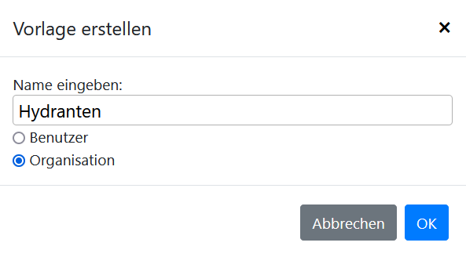
