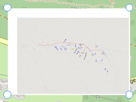
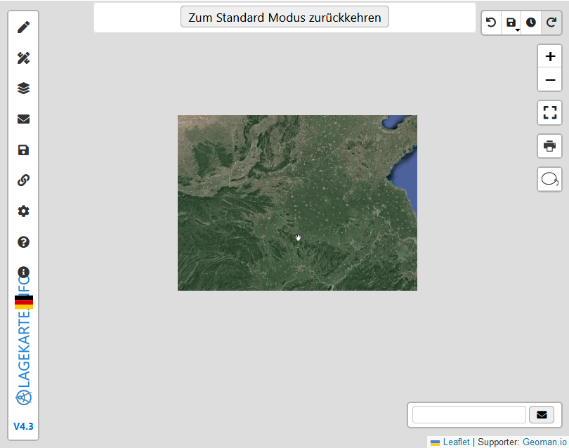
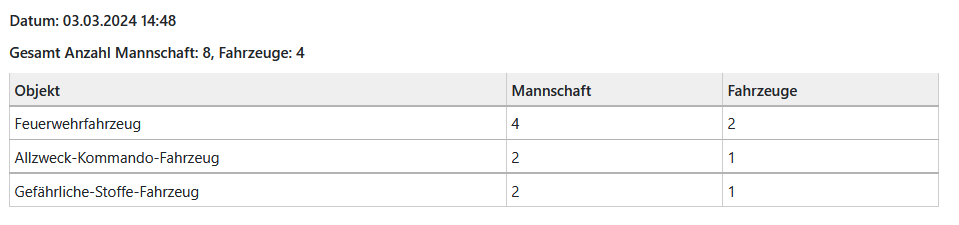

# Funktionen

In diesem Tab der Sidebar befinden sich diverse Funktionen.

## Pumpen Berechnung | Relais Leitung (AT)

Eine automatische Berechnung von Pumpenstandorten anhand einer Strecke und der Steigung.

Die Berechnung wird von dem [Elevation-Service](https://elevation.geocode.at/) durchgeführt.

### Zeichnen

Zum zeichnen der Strecke, können 3 unterschiedliche Modi ausgewählt werden:
 - Modus 1: An Straße anhacken. Der Mauszeiger wird zu der nächstgelegenen Straße hingezogen.
 - Modus 2: Kürzesten Weg berechenen. Das Programm berechnet selber den kürzesten Weg, entlag von Straßen oder Wegen. Mit gedrückter Shift-Taste können Zwischenpunkte gesetzt werden. (Standard)
 - Modus 3: Freihandzeichen. Gleich wie Modus 1, nur ohne anhacken.

### Einstellungen

| Standard-Wert | Beschreibung                                                                       |
|---------------|------------------------------------------------------------------------------------|
| 8 Bar         | Druckverlust auf der Leitung bis zur nächsten Pumpe                                |
| 100 Meter     | Länge der ebenen Leitung die 1 Bar Druckverlust verursacht                         |
| 10%           | Faktor für die einberechnete Schlauchreserve für nicht gerade verlegeter Schläuche |

## Bild einfügen | Eigene Karte

Es kann auf der aktuellen Karte ein Bild hinzugefügt werden oder ein Bild als neue Karte verwendet werden.

### Hochladen

Es können PDFs oder Bilder hochgeladen werden und passend gedreht werden.
Bei einem PDF kann zusätzlich die Seite ausgewählt werden.

!> Es können **maximal 5MB** hochgeladen werden.

[Hinzufügen](#hinzufuegen) fügt das Bild auf der aktuellen Karte hinzu. Mit [Öffnen](#oeffnen) wird das Bild als eigene Karte geöffnet.

### Hinzufügen (Bild einfügen)

Bild zu der aktuellen Karte hinzufügen.

Zum verschieben / vergrößern des Bildes muss im Contextmenü (Rechte-Maustaste auf das Bild) *Bearbeiten* ausgewählt werden. Um das Bearbeiten zu beenden, muss wieder das Contextmenü geöffnet werden und *Bearbeiten beenden* ausgewählt werden. 

Zum **Entfernen** des Bildes muss im Contextmenü (Rechte-Maustaste auf das Bild) *Entfernen* ausgewählt werden.

?> Bilder können nur über das Contextmenu bearbeitet / entfernt werden, da es nicht durch versehentliches bearbeiten von einem Objekt verändert werden soll.

### Öffnen (Eigene Karte)

Bild als eigene Karte verwenden. Dieses bietet sich z.B. für Brandschutzpläne oder Geländebilder an.

!> In diesem Modus stehen nicht alle Funktionen zur Verfügung, da es kein Koordinatensystem gibt.

## TALIS | MAR

## Tankpendelverkehr 

Eine Funktion um die verfügbare Menge an Wasser zu berechnen.

## Suche | Koordinaten konverter

Die Karte zu Koordinaten bewegen oder eine Konvertierung der Koordinaten.

Für die Suche über Koordinaten oder die Konvertierung, muss ausgewählt werden von welchem Feld die Werte genommen werden sollen, damit im Hintergrund die GPS Koordinaten (LatLng) ermittelt werden können.

?> Der Dialog kann auch über den Such-Control geöffnet werden. 

## Messen

Eine Fläche ausmessen.

## Gefahrgutzonen einzeichnen

Erstellt Gefahrgutzonen mit dem Radien *30m*, *60m*, *300m* und *1000m*

## Mannschaftsliste

Zeigt die Mannschaft aller Objekte auf der Karte an.

Kann auch ausgedruckt werden:

## WMS Layer

Importieren eines WMS Layers über eine *URL+Layer* oder über eine *GetCapabilities-URL*.

Wenn der Import über eine *GetCapabilities-URL* erfolgt, können die zu Importierenden Layer ausgewählt werden.

## Daten importieren

Es können Objekte über eine URL, Datei oder Text importiert werden. 

Folgende Formate sind möglich:
 - GeoJSON
 - KML
 - GPX

Beim import über eine *URL*, kann auch angegeben werden, nach wie vielen Minuten das Objekt neu geladen werden soll. Kann z.B. zum Tracken eines Fahrzeuges verwendet werden.

