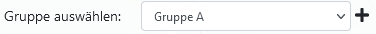
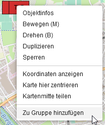

# Layers

Ein- und Ausblenden von Objekten.

Es gibt die Standard Layer:
 - Alles
 - Zeichnungen
 - Alle Marker
 - Taktische Zeichen
 - Fahrzeuge

Und weitere, welche zusammen mit der Verwendung einer API erscheinen:
 - Wasserkarte.info
 - Hydrantenmap
 - Objektdatenbank

## Gruppen

Es werden die angelegten Gruppen angezeigt.

?> Gruppen können dazu verwendent werden, um Objekte in einer selbstgewählten Kategorie zu sammeln.

Gruppen können über das *Hinzufügen*-Symbol in der Leiste oder im Tab-*Zeichnen* erstellt werden.

Tab-*Zeichnen*:

Für die Verwendung muss entweder im Tab-*Zeichnen* die Gruppe selektiert werden und dann werden alle neu gezeichneten Objekte automatisch der Gruppe hinzugefügt. Oder über das Contextmenu (Rechtsklick) des Objekts, *Zu Gruppe hinzufügen* auswählen.

Gruppen können Ein- und Ausgeblendet werden, umbenannt und gelöscht werden. 

!> Beim Löschen einer Gruppe, werden auch alle Objekte, welche in der Gruppe sind, gelöscht!

## WMS Layer

WMS Layer können über das *Hinzufügen*-Symbol in der Leiste oder im [Tab-*Funktionen*](sidebar/../funktionen.md#wms-layer) hinzugefügt werden.

Die angezeigten WMS-Layer können *ausgeblendet* oder *entfernt* werden.

## GeoTIFF Layer

GeoTIFF Layer, welche über [Daten importieren](sidebar/../funktionen.md#daten-importieren) hinzugefügt wurden, erscheinen hier und können *ausgeblendet* oder *entfernt* werden.