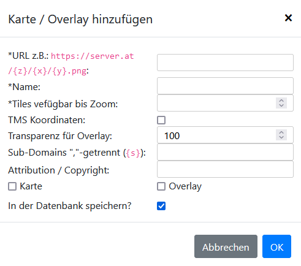

# Karten & Overlays

Es kann immer nur eine *Karte* aktiv sein, es können aber mehrere *Overlays* gleichzeitig eingeblendet werden.

Karten:
 - OpenStreetMap
 - Geländekarte
 - Topographische Karte
 - Druckerkarte
 - Satellitenkarte
 - Voyager-Karte
 - Basemap (AT)

Overlays:

| Name                        | Beschreibung                                                                                   |
|-----------------------------|------------------------------------------------------------------------------------------------|
| Zusätzliche Übersichtskarte | Blendet an der rechten Seite eine Satellitenkarte ein, welche sich gemeinsam mit Karte bewegt. |
| Straßennamen (AT)           | Zeigt Straßennamen in Österreich an.                                                            |
| Defibrillatoren (AT)        | Zeigt Defibrillatoren in Österreich an. Quelle: [Definetzwerk.at](https://definetzwerk.at/)    |
| Sensordaten                 | Zeigt Sensordaten von der [OpenSenseMap](https://opensensemap.org/) an.                         |
| Wasserpegel Stationen       | Zeigt Wasserpegel Stationen Weltweit an. Quelle: [PegelAlarm.at](https://pegelalarm.at/)       |

## Hinzufügen

Es können über den *Hinzufügen*-Button weitere Karten / Overlays hinzugefügt werden.

Optionen:

| Option                     | Beschreibung                                                                                                                                                                                                                                                                |
|----------------------------|-----------------------------------------------------------------------------------------------------------------------------------------------------------------------------------------------------------------------------------------------------------------------------|
| URL                        | Die URL, welche zu dem Tile-Server zeigt: `https://{s}.server.at/{z}/{x}/{y}.png`. Die Platzhalter `{s}` (optional), `{z}`, `{x}` und `{y}` werden automatisch mit dem Bewegen der Karte befüllt. Sie stehen für *S*ubdomain (optional), *Z*oom und Koordinate *X* und *Y*. |
| Name                       | Anzeige Name in der Liste.                                                                                                                                                                                                                                                  |
| Tiles verfügbar bis Zoom   | Bis zu welcher Zoom-Stufe der Tile-Server Bilder liefert und ab wann ein Bild vergrößert werden muss.                                                                                                                                                                       |
| TMS Koordinaten            | Sollen die Koordinaten im TMS-Format an den Tile-Server gesendet werden.                                                                                                                                                                                                    |
| Transparenz für Overlay    | Wert zwischen 1 und 100.                                                                                                                                                                                                                                                    |
| Sub-Domains                | Über welche Server / Domains abwechselnd zugegriffen werden soll. Wenn nichts eingetragen wird aber der Platzhaler vorhanden ist, wird `a`, `b` oder `c` eingefügt.                                                                                                         |
| Attribution / Copyright    | Was auf der Karte rechts unten angezeigt wird. Verwendungshinweis.                                                                                                                                                                                                          |
| Karte / Overlay            | Ob als Karte und / oder Overlay gespeichert werden soll.                                                                                                                                                                                                                    |
| In der Datenbank speichern | 🔑 Es kann die Karte / Overlay auch auf dem Benutzer in der Datenbank gespeichert werden.                                                                                                                                                                        |

