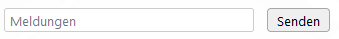

# Meldungen

Ein Tool um Protokoll über die aktuelle Situation zu führen.

## Meldung anlegen

Es gibt drei unterschiedliche wege eine Meldung zu erstellen.

### 1. Eingabefeld im Tab-Meldungen

### 2. Eingabefeld auf der Karte

### 3. Contextmenü "Meldung hier einfügen"

Mit dem öffnen des Contextmenüs (Rechts Klick) der Karte, kann *Meldung hier einfügen* ausgewählt werden.

Dadurch öffnet sich der Tab-*Meldungen* und Koordinaten werden in das Eingabefeld hinzugefügt. 

Nach dem hinzufügen einer Meldung wird ein Marker an der Stelle auf der Karte erstellt. 

## Funktionen

### Download

Die Meldungen können als `.csv` Datei heruntergeladen werden.

### Löschen

Über den Button *Löschen* können alle Meldungen entfernt werden.

### Teilen / Speichern

Über die Checkbox *Mit anderen teilen / speichern* wird definiert, ob die Meldungen auf dem Projekt gespeichert werden sollen und dadurch beim Teilen der Karte veröffentlicht werden.

