# Speichern und Teilen

## Zeitleiste

Über die Zeitleiste ist es möglich zwischen verschiedenen Zeitpunkten hin und her zu springen. Dadurch ist ein Verlauf im nachhinein einsehbar.
Es gibt immer die Zeitpunkte Einsatzbeginn und Aktuell.

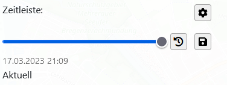

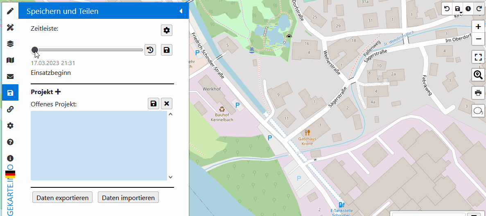

!> Wenn die Zeitleiste **nicht** auf dem Zeitpunkt *Aktuell* ist und gezeichnet wird, dann wird der *Aktuell*-Zeitpunkt mit der neuen Karte überschrieben.

### Zeitpunkt erstellen

Über den Speichern Button oder über Zeitpunkt Button in dem History-Control, wird die aktuelle Karte als Zeitpunkt unter einem Namen abgespeichert.

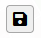 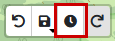

### Zeitpunkte bearbeiten

Über den Settings-Button können Zeitpunkte umbenannt oder gelöscht werden.

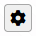

### Zum aktuellen Zeitpunkt 

Über den Zurücksetzen-Button springt die Zeitleiste zu dem aktuellen (ungespeicherten) Zustand der Karte zurück.

## 🔑 Projekte

?> Projekte können nur mit einem **kostenlosen** Account angelegt werden.

Um eine Lagekarte zu speichern, gibt es die möglichkeit die Karte als **Projekt** abzuspeichern.
Diese werden mit dem Benutzer verknüpft und können ganz einfach zu einem späteren Zeitpunkt wieder geladen werden.

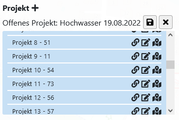

### Projekt erstellen

Über den *Plus*-Button, kann ein neues Projekt erstellt werden.

Es kann ein Name für das neue Projekt angegeben werden und dann wird die aktuelle Karte initial gespeichert **oder** es wird ein [Share-Link](#projekt-teilen) eingefügt und dadurch eine Kopie des geteilten Projekts gespeichert.

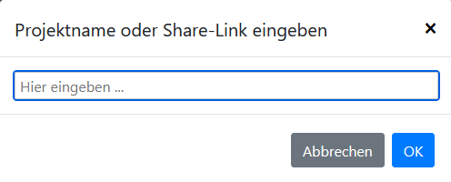

### Projekt speichern

Über den Speichern-Button kann die aktuelle Karte auf dem aktuell offenen Projekt gespeichert werden. Wurde das Projekt über den *X*-Button geschlossen oder kein Projekt geöffnet, wird beim speichern ein neues Projekt erstellt.

Über den Speichern-Button in dem History-Control kann das Projekt gespeichert werden. Des weiteren kann mit **Rechts-Klick** auf den Speichern-Button ein **Automatisches Speichern** hinterlegt werden.

?> Es können leider keine kürzere Zeitabstände beim automatisch speichern angeboten werden, da dadurch die Server an ihre Grenzen kommen.

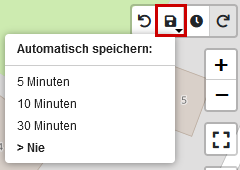

### Projekt laden

Über den *Karten*-Button kann das Projekt geladen werden.

!> Achtung die aktuelle Karte wird dabei überschrieben.

### Projekt teilen

Ein Projekt kann über einen Link mit anderen Personen geteilt werden. Beim klicken auf den *Link*-Button wird der Link in den Zwischenspeicher kopiert.

!> Dabei muss beachtet werden, dass nicht mehrere Personen an dem gleichen Projekt arbeiten können. Nur das Quellprojekt kann bearbeitet werden und teilt diese Änderungen danach.

Ein geteilter Link kann in den Einstellungen eines Projekts durch eine Neugenerierung ungültig gemacht werden.

Wird ein geteiltes Projekt geladen, erscheint nach einer Speicherung des Quell-Projekts innerhalb von 2 Minuten eine Abfrage, ob die neusten Daten geladen werden sollen. 

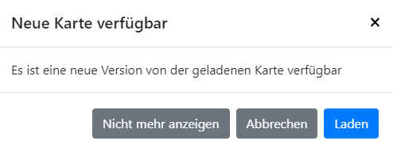

### Projekt-Einstellungen

Um zu den Projekt-Einstellungen zu gelangen, muss auf den *Bearbeiten*-Button geklickt werden.

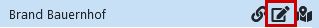

1. Der Name des Projekts kann geändert werden
2. Eine Neugenerierung des *Share-Links*. **Achtung** dadurch werden alle bisher geteilten Links ungültig.
3. Projekt in neuem Tab öffnen
4. QR-Code anzeigen
5. Projekt kopieren und neu abspeichern
6. Projekt löschen

## Import / Export

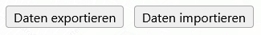

### Daten exportieren

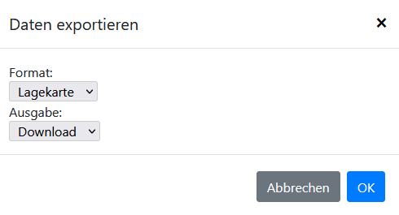

Die aktuelle Karte kann in verschiedenen Format exportiert werden.

| Format    | Beschreibung                                             |
|-----------|----------------------------------------------------------|
| Lagekarte | Exportiert alles von dem aktuellen Projekt.              |
| GeoJSON   | Exportiert nur die Positionen der Objekte auf der Karte. |
| KML       | Exportiert nur die Positionen der Objekte auf der Karte. |
| GPX       | Exportiert nur die Positionen der Objekte auf der Karte. |

### Daten importieren

Es kann nur das *Lagekarte*-Format für den Import verwendet werden. Für andere Datei-Formate muss die Funktionen [Daten importieren](sidebar/../funktionen.md#daten-importieren) verwendet werden.

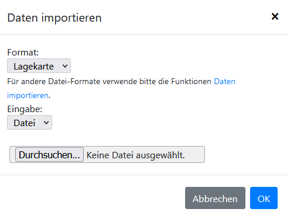