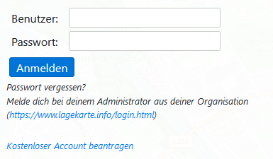
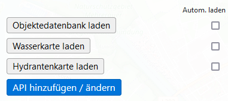
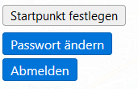
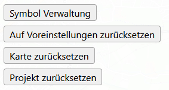

# Einstellungen

## Login
Über einen **kostenlosen** Account stehen weitere Features zur Verfügung. Diese sind mit einem 🔑 gekennzeichnet.

Weitere Infos für die Registrierung: [🔐 Registrieren / Login](account.md)

## 🔑 APIs / Externe Dienste

Es können Objekte von externen Diensten / APIs eingebunden werden.

Mit der Option *Autom. laden*, kann das automatische laden der Daten für diese API aktiviert werden.

## 🔑 User-Einstellungen

Es kann der Startpunkt der Karte beim öffnen von lagekarte.info geändert werden. Standardmäßig wird der Standort der Organisation verwendet.

Acuh kann hier das Passwort geändert werden und sich abgemeldet werden.

## Projekt-Einstellungen

| Funktion                          | Beschreibung                                                                                     |
|-----------------------------------|--------------------------------------------------------------------------------------------------|
| Symbol Verwaltung                 | Es kann eingestellt werden, welche Symbol-Sets im *Zeichnen*-Tab angezeigt werden sollen.        |
| Auf Voreinstellungen zurücksetzen | Alle Meldungen und Farbfelder werden entferntFarbfelder.                                         |
| Karte zurücksetzen                | Alle Objekte auf der Karte werden entfernt, sowie alle Zeitpunkte und die History zurückgesetzt. |
| Projekt zurücksetzen              | Kombination von *Auf Voreinstellungen zurücksetzen* und *Karte zurücksetzen*.                    |

### Symbol Verwaltung

| Funktionen                    | Beschreibung                                                 |
|-------------------------------|--------------------------------------------------------------|
| Symbole dynamisch verkleinern | Verkleinert Symbole dynamisch ab der eingestellen Zoomstufe. |
| Dynamischer Zoom Basis        | Ab welcher Zoomstufe die Symbole verkleinert werden.         |
| Symbole vergrößern            | Vergrößert alle Symbole um die eingestellten Prozent.        |
| Sichtbare Symbole             | Symbol-Sets welche im *Zeichnen*-Tab verfügbar sein sollen.  |

