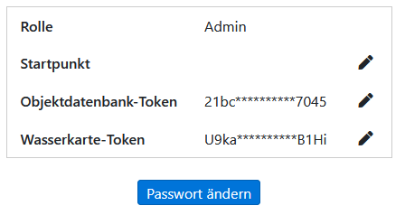
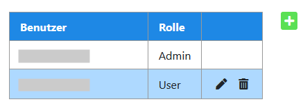
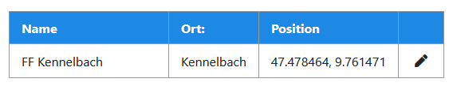

# 🔑 User Verwaltung

Über [www.lagekarte.info/login.html](https://www.lagekarte.info/login.html) findet die User / Organisations Verwaltung statt.

!> Es können sich nur Benutzer anmelden, welche die `Admin` Rolle haben.

## Profil

| Einstellung     | Beschreibung                                                                                                                                                  |
|-----------------|---------------------------------------------------------------------------------------------------------------------------------------------------------------|
| Rolle           | Zeigt die Rolle des Benutzers an. `Admin` oder `User`.                                                                                                        |
| Startpunkt      | Legt fest bei welchen Koordinaten die Karte beim öffnet angezeigt werden soll. Standardmäßig wird der Startpunkt der Organisation verwendet.                  |
| APIs            | Es können existierende APIs / Externe Dienste geändert oder gelöscht werden. Mehr infos unter [*Einstellungen*](sidebar/settings.md#🔑-apis--externe-dienste) |
| Passwort ändern |                                                                                                                                                               |

?> Alle Einstellungen können auch auf [www.lagekarte.info](https://www.lagekarte.info/) in dem [*Einstellungen*-Tab](sidebar/settings.md) geändert werden.

## Users

Übersicht über alle Benutzer der Organisation.

Es können **neue** Benutzer erstellt weden, **Passwörter** oder **Rollen** von anderen Benutzern in der Organisation geändert werden oder Benutzer komplett **gelöscht** werden.

## Organisation

Es kann der Name, Ort und die Position der Organisation geändert werden.

